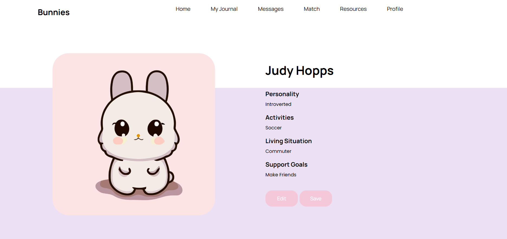

# UBC-Bunnies 🐰

A modern, responsive web application showcasing advanced frontend development skills and UI/UX design principles. UBC-Bunnies is a mental health support platform that demonstrates proficiency in HTML5, CSS3, JavaScript, and modern web development practices.

## 🌟 Project Highlights

### Frontend Development Skills Demonstrated
- **Responsive Web Design** - Mobile-first approach with fluid layouts
- **Modern CSS Techniques** - Flexbox, Grid, custom properties, and animations
- **JavaScript ES6+** - Classes, modules, DOM manipulation, and event handling
- **UI/UX Design** - Intuitive navigation, accessibility, and user experience
- **Cross-browser Compatibility** - Works seamlessly across all modern browsers
- **Performance Optimization** - Optimized assets and efficient code structure

### Design & User Experience
- **Clean, Modern Interface** - Professional design with attention to detail
- **Intuitive Navigation** - Seamless user flow and clear information architecture
- **Accessibility Features** - Semantic HTML, proper ARIA labels, and keyboard navigation
- **Visual Hierarchy** - Effective use of typography, spacing, and color theory
- **Interactive Elements** - Smooth animations and engaging user interactions

## 📸 Project Showcase

### Landing Page

*Modern, responsive landing page with motivational messaging and clean UI design*

### User Interface Components




### Key Features Demonstrated
- **Clean Authentication UI** - Professional login interface with bunny-themed design
- **User Profile Management** - Comprehensive profile creation and editing interface
- **Real-time Messaging** - Interactive messaging system with user avatars
- **Peer Matching System** - Advanced user matching interface with detailed profiles

### Responsive Design


*Note: Replace placeholder images with actual screenshots of your running application*

## 🏗️ Project Structure

```
UBC-Bunnies/
├── beforeLoginHomePage/     # Landing page with modern UI
├── afterLoginHomePage/      # Dashboard interface
├── Login/                   # Authentication UI components
├── Profile/                 # User profile interface
├── Journal/                 # Interactive journaling feature
├── Messages/                # Real-time messaging UI
├── Resources/               # Resource library interface
├── match/                   # User matching interface
├── navigationBars/          # Reusable navigation components
├── images/                  # Optimized SVG icons and assets
├── Users.js                 # Frontend data management
├── bunnies.csv              # Sample data for UI demonstration
└── index.html               # Application entry point
```

## 🚀 Quick Start

### Prerequisites
- Python 3.x (for local development server)
- Modern web browser (Chrome, Firefox, Safari, Edge)

### Running the Project

1. **Open Terminal/Command Prompt**
2. **Navigate to the project directory:**
   ```bash
   cd path/to/UBC-Bunnies
   ```

3. **Start the local development server:**
   ```bash
   python -m http.server 8000
   ```

4. **Open your web browser and navigate to:**
   ```
   http://localhost:8000
   ```
   
   **Or directly access the main interface:**
   ```
   http://localhost:8000/beforeLoginHomePage/beforeLoginHome.html
   ```

5. **Stop the server when done:**
   - Press `Ctrl+C` in the terminal

## 🎨 UI/UX Features

### Design System
- **Consistent Color Palette** - Carefully selected colors for accessibility and brand identity
- **Typography Hierarchy** - Google Fonts (Manrope) with proper font scaling
- **Component Library** - Reusable UI components with consistent styling
- **Icon System** - Custom SVG icons and illustrations

### Responsive Design
- **Mobile-First Approach** - Optimized for mobile devices
- **Fluid Layouts** - Flexible grids and containers
- **Breakpoint Strategy** - Smooth transitions between screen sizes
- **Touch-Friendly Interface** - Appropriate button sizes and spacing

### Interactive Elements
- **Smooth Animations** - CSS transitions and transforms
- **Hover Effects** - Engaging micro-interactions
- **Form Validation** - Real-time user feedback
- **Loading States** - Professional loading indicators

## 🛠️ Technical Implementation

### Frontend Technologies
- **HTML5** - Semantic markup and accessibility
- **CSS3** - Modern styling with Flexbox, Grid, and custom properties
- **JavaScript (ES6+)** - Classes, modules, and modern syntax
- **jQuery** - Enhanced DOM manipulation and AJAX functionality

### Development Practices
- **Modular Architecture** - Organized file structure and component separation
- **Clean Code** - Readable, maintainable, and well-commented code
- **Performance Optimization** - Optimized images and efficient CSS/JS
- **Cross-browser Testing** - Consistent experience across browsers

### Code Quality
- **Semantic HTML** - Proper use of HTML5 elements
- **CSS Best Practices** - BEM methodology and organized stylesheets
- **JavaScript Standards** - ES6+ features and modern patterns
- **Accessibility** - WCAG guidelines and screen reader support

## 📱 Interface Components

### Landing Page
- **Hero Section** - Compelling value proposition and call-to-action
- **Feature Highlights** - Clear presentation of platform benefits
- **Navigation** - Intuitive menu structure and user flow

### User Interface
- **Dashboard Design** - Clean, organized information architecture
- **Profile Management** - User-friendly profile creation and editing
- **Interactive Features** - Engaging user interactions and feedback

### Content Management
- **Dynamic Content** - JavaScript-driven content updates
- **Form Handling** - Professional form design and validation
- **Data Visualization** - Clear presentation of user statistics

## 🎯 Portfolio-Ready Features

### Professional Development
- **Modern Web Standards** - Up-to-date with current best practices
- **Responsive Design** - Mobile-first, progressive enhancement
- **Performance Focused** - Optimized loading times and user experience
- **Maintainable Code** - Clean, documented, and scalable architecture

### Design Excellence
- **Visual Design** - Professional, modern aesthetic
- **User Experience** - Intuitive navigation and clear information hierarchy
- **Accessibility** - Inclusive design for all users
- **Brand Identity** - Consistent visual language and messaging

## 📊 Technical Achievements

### Frontend Development
- **Responsive Layout** - Fluid design that works on all devices
- **Interactive Components** - Engaging user interface elements
- **Performance Optimization** - Fast loading and smooth interactions
- **Cross-browser Compatibility** - Consistent experience across platforms

### Code Quality
- **Clean Architecture** - Well-organized file structure
- **Maintainable Code** - Readable and documented implementation
- **Modern Standards** - Current web development best practices
- **Scalable Design** - Extensible component system

## 🤝 Development Approach

This project demonstrates:
- **User-Centered Design** - Focus on user needs and experience
- **Modern Development** - Current web technologies and practices
- **Quality Assurance** - Attention to detail and testing
- **Professional Standards** - Production-ready code quality

## 📞 Technical Support

For development questions or issues:
- Check browser console for JavaScript errors
- Verify all files are properly linked
- Ensure server is running on correct port
- Test across different browsers and devices

## 🎨 Design Philosophy

UBC-Bunnies showcases professional frontend development with:
- **Modern Aesthetics** - Clean, contemporary design language
- **User-Focused UX** - Intuitive and accessible interface
- **Technical Excellence** - Robust, maintainable codebase
- **Performance Optimization** - Fast, responsive user experience

---

**Note**: This project demonstrates advanced frontend development skills, modern UI/UX design principles, and professional web development practices suitable for portfolio presentation. 🐰✨